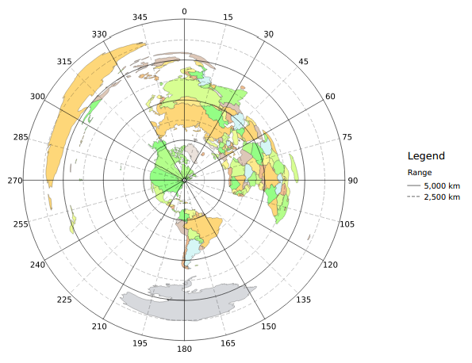

# N1YWB Equidistant Azimuthal Map Toolkit #

Copyright 2014 by Jeffrey M. Laughlin

This free toolkit provides an easy way to get started with equidistant
azimuthal maps using the free Quantum GIS 2.0 application. 

It includes the following features:

* A complete QGIS 2 project http://www.qgis.org
* World basemap from http://www.naturalearthdata.com/
* Polar graticule with 5,000km & 30deg major and 2,500km & 15deg minor ticks
* Polar graticule generation script
* Lat/lon graticule
* Saved style files for base map, polar, and lat/lon graticules
* Print composer template optimized for US Letter sized paper
* Tested with QGIS 2.0.1-Dufour

## How to use project ##

Just open it in QGIS 2. It should already be in pretty good shape for most world map use
cases, e.g. plotting DX QSOs.

I don't care for the lat/lon graticule so it's turned off by default.

### IMPORTANT NOTE ON CUSTOM CRS ###

This project includes a custom CRS configured for equidistant azimuthal projection. If you have not configured any other custom CRS's, this CRS will be called 'USER:100000'. If you do have other custom CRSs you'll have to find the number in the CRS list; look for `+proj=aeqd`. You may also add it again if necessary, the full definition is:

    +proj=aeqd +lat_0=44.197227 +lon_0=-72.486237 +x_0=0 +y_0=0 +a=6371000 +b=6371000 +units=m +no_defs

Change the `lat` and `lon` parameters to your QTH lat & lon.

All layers must have their CRS set to this projection, and you must also specify this projection when running the `create_polar_graticule.py` script.

## How to change map center ##

To center the map on your QTH, you need to edit the custom CRS.

Go to the Settings menu and select "Custom CRS". You should see something like

    +proj=aeqd +lat_0=44.197227 +lon_0=-72.486237 +x_0=0 +y_0=0 +a=6371000 +b=6371000 +units=m +no_defs

Change the `lat` and `lon` parameters to your QTH lat & lon and click OK.

Click the "Refresh" button on the toolbar. The map should now be recentered.

## How to print the map ##

Go to `Project --> Composer manager`

Expand 'New from template'

Select `Specific` from the dropdown menu and click `...`

Select the `print composer template.qpt` file included with the project.

Click the `Add` button. You will be prompted for a name, you may leave it
blank. Click `OK`.

The new print composer window should now appear.

## How to change the base map ##

`Layer menu --> New --> New Shapefile Layer`

Select the basemap shapefile, e.g. `ne_50m_admin_0_countries`.

Open the properties for the new layer. Go to "Style". Click "Load Style" and
select the map style file included in the project. Customize as desired.

## How to customize the graticule ##

Refer to the style rules in the graticule layer properties. 

To change the major/minor spacing, copy the `create_polar_graticule.py` script
to your qgis scripts directory.

Linux script directory:

    /home/jeff/.qgis2/processing/scripts

Windows scripts directory:

    C:\Program Files\QGIS Dufour\apps\qgis\python\plugins\processing\script\scripts

Restart QGIS.

Go to the Processing menu and display the toolbox if it's not already visible.

Go to `Scripts --> User scripts`

Double click `create polar graticule`

Most of the settings are pretty self explanitory. Units are in meters or
degrees. 

`label offset` deserves a bit of explanation; it sets how far away the
degree labels appear from the outermost major range ring. The default value is
fine for world maps. For smaller maps you may need to decrease the value. If
you can come up with a scale independent way to space the labels from the outer
ring, drop me a line.

Be sure to save the graticule and graticule labels to permanent files, not
temporary files, if you want to see them again the next time you run qgis.

For both of the new layers, go into the Properties, and set the CRS to
'USER:100000'. Load the style files included in the project and customize as
desired.

## License ##

The basemap from Natural Earth Data is in the public domain.

The polar graticule generation script is released under the AGPL 3.0.

All other files and data, unless noted otherwise, are released under the
Creative Commons Attribution-ShareAlike 4.0 International Public License.

## Thanks ##

Thanks to Andrew Webster for providing assistance and inspiration. For more
information on making maps of amateur radio QSOs, please visit his blog:
http://alloutput.com/amateur-radio/using-gis-for-radio-maps

